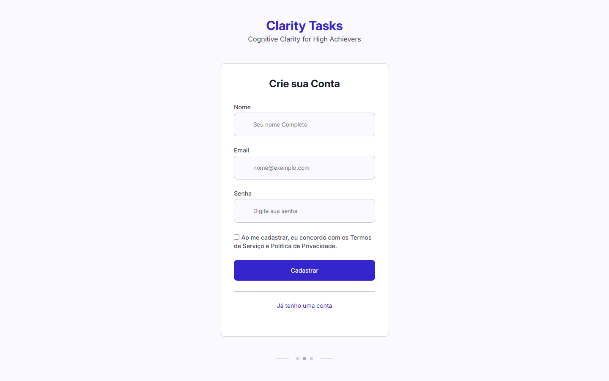

# ✅ Clarity Tasks

App de lista de tarefas com telas de cadastro e login. Os dados ficam salvos no `localStorage` do navegador.

🔗 **[Ver online](https://kayandenizo.github.io/claritytasks/)**

## Funcionalidades

- Cadastro de usuário (`front/src/index.html`)
- Login (`front/src/signin.html`)
- Adicionar e listar tarefas (`front/src/homepage.html`)

## Como rodar

Não precisa instalar nada: basta abrir o arquivo `front/src/index.html` no navegador (ou usar a extensão **Live Server** do VS Code).

---

Feito por [Kayan Denizo](https://github.com/KayanDenizo).
